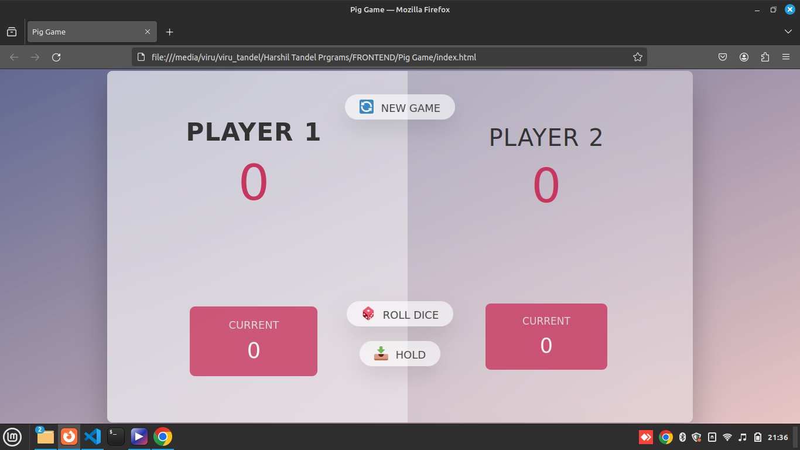

# Pig Game 🎲

A fun and simple dice game called Pig, implemented in JavaScript, HTML, and CSS.

## Live Demo 🚀

Check out the live demo [here](https://two-player-timepass.netlify.app/)

## Screenshots 📸


*Game Start*


## How to Play 📜

1. The game has two players, playing in rounds.
2. In each turn, a player rolls a dice as many times as they wish. Each result gets added to their current score.
3. If the player rolls a `1`, their current score gets lost, and it's the next player's turn.
4. The player can choose to 'Hold', which means their current score gets added to their global score. It's then the next player's turn.
5. The first player to reach 100 points on the global score wins the game.

## Getting Started 🛠️

### Prerequisites

- A modern web browser

### Installation

1. Clone the repository:
    ```sh
    git clone https://github.com/HarshilTandel/PigGame.git
    ```
2. Open the `index.html` file in your browser to start the game.

### Built With

- HTML
- CSS
- JavaScript

## Features 🌟

- Two-player game with alternating turns
- Roll dice and hold current score
- Reset game functionality

## Contributing 🤝

Contributions are welcome! Please fork this repository and create a pull request with your changes.

1. Fork the Project
2. Create your Feature Branch (`git checkout -b feature/AmazingFeature`)
3. Commit your Changes (`git commit -m 'Add some AmazingFeature'`)
4. Push to the Branch (`git push origin feature/AmazingFeature`)
5. Open a Pull Request

## License 📄

Distributed under the MIT License. See `LICENSE` for more information.

## Acknowledgements 🙏

- [OpenAI](https://openai.com) for the assistance in generating this README file.
- [MDN Web Docs](https://developer.mozilla.org/) for the great documentation on web technologies.
